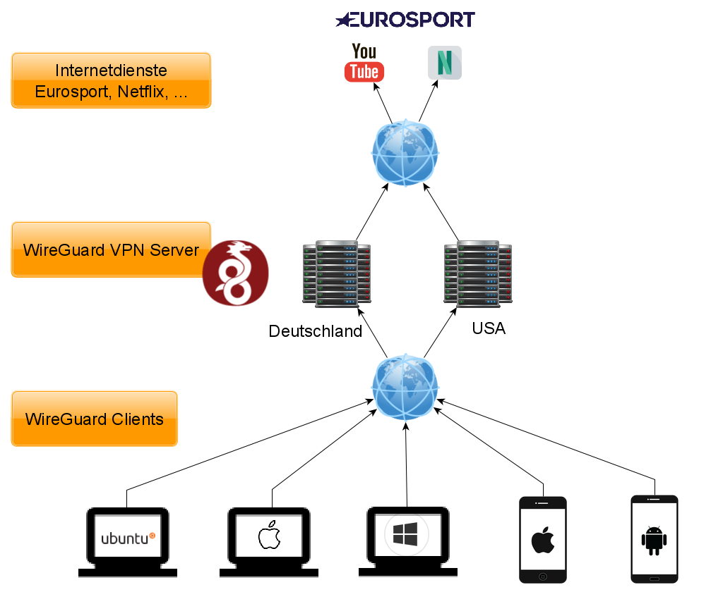
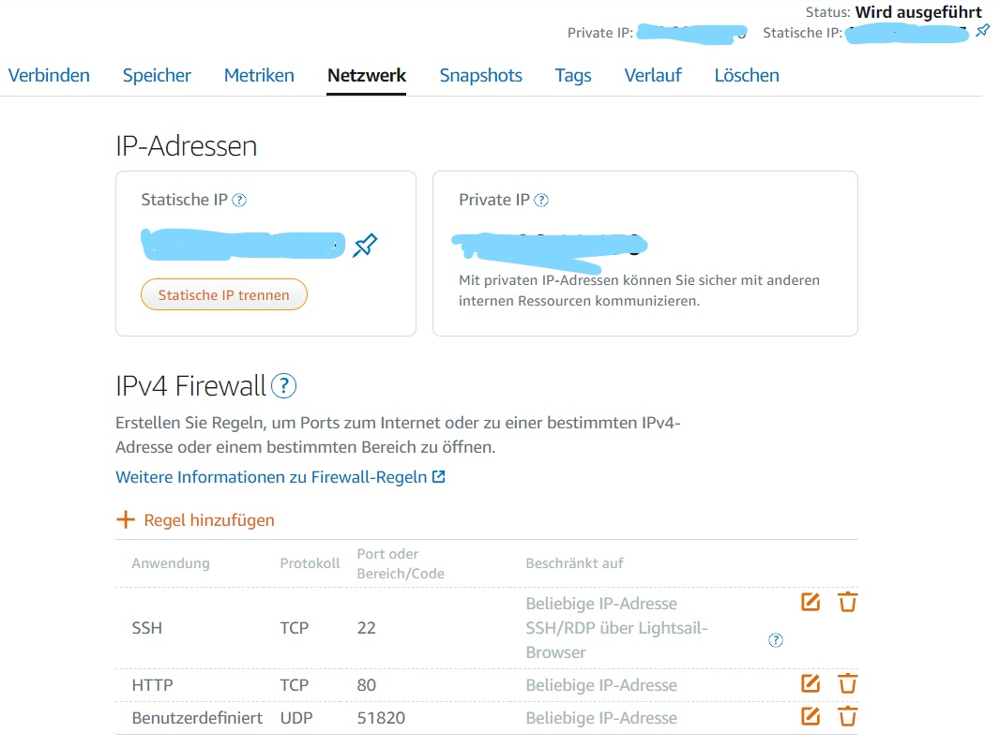

# exampleFamilyVPN
Beispiel für ein Familien-VPN mit WireGuard
# familyVPN #
Achtung: Das ist keine Drag-and-Drop Anleitung.  
**Hintergrundinfos findest du hier [https://www.wireguard.com/](https://www.wireguard.com/)**    
WireGuard ist ein schnelles, einfaches und modernes VPN-Protokoll. Hier kannst du lesen, wie du für eine Familie ein eigenes VPN-System selbst einrichten kannst. 
> Dieses VPN ist nicht 100% abhörsicher. Du bist aber auf einem guten Weg dahin. Edward Snowden wäre stolz auf dich ;-)  

Ich nutze für dieses Beispiel einen Amazon-Server basierend auf AWS Lightsail (für nur US$ 3,50 pro Monat). Ich will zeigen, wie du mit zwei Servern in Deutschland und den USA für einige wenige Clients (Smartphone mit Android und IOS sowie Notebooks) zwei private Netzwerke aufbauen kannst.  
**Mit diesem VPN können aus Deutschland z.B. amerikanische Zeitungenswebseiten oder ein amerikanischer Netflix-Account und aus den USA die Mediatheken der öffentlich-rechtlichen Rundfunkanstalten oder der Eurosport-Player genutzt werden.**

 
Übersicht FamilyVPN

Wir benötigen Server in Deutschland und den USA mit jeweils einer öffentlichen IP-Adresse und müssen in den Firewalls zusätzlich einen Port für WireGuard öffnen (UDP, Port 51820). Die Server lassen sich nach Anmeldung und Buchung per Klick einrichten. Ich habe als Betriebssystem Ubuntu 20.04 gewählt. Wir benötigen keine sonstigen vorkonfigurierten Pakete.
 
AWS Firewallregeln

Bei Amazon Lightsail ist per Klick im Browser eine Verbindung zum Server möglich. Der SSH-Port 22 und TCP-Port 80 werden deshalb in unserem Projekt nicht benötigt und könnten aus Sicherheitsgründen geschlossen werden. Ich lasse sie aber erstmal offen. (Um ein sichereres Netzwerk zu schaffen, solltest du z.B. alle Ports schließen, wenn du mit der Einrichtung fertig bist. Du solltest WireGuard auch noch eine Verschlüsselung hinzufügen. Das lasse ich hier im Beispiel weg.)
Um eine Verbindung zum Server im Terminal per SSH aufzubauen ist ein Schlüsselaustausch notwendig. Dazu muss ein privater Schlüssel erzeugt und runtergeladen und gespeichert werden. Das geht alles automatisch per Klick über das aws-Portal. Mein Schlüssel wurde als **.pem-Datei** (LightsailDefaultKey-eu-central-1.pem) geliefert.  

Der ssh-Aufruf vom Windows-PC lautet dann z.B. so:  
`ssh -i C:\Users\toral\Documents\FamilienVPN\LightsailDefaultKey-eu-central-1.pem ubuntu@xxx.xxx.xxx.xxx`  
Hinter ssh -i steht der Pfad zur Schlüsseldatei incl. der .pem-Datei, danach folgt der Nutzername@ und die öffentliche IP-Adresse unseres neuen Servers.  
Damit bist du per SSH auf dem Server.  
**Welcome to Ubuntu 20.04.1 LTS (GNU/Linux 5.4.0-1018-aws x86_64)**  
Jetzt schnell noch das System aktualisieren und WireGuard und ein Tool zur Erzeugung von QR-Codes installieren:  
## WireGuard-Installation ##
```
sudo apt update  && sudo apt upgrade  
sudo apt install wireguard  
sudo apt install qrencode  
```
## Schlüssel erzeugen ##
```
sudo su  
cd /etc/wireguard  
mkdir keys  
wg genkey | tee keys/server_private_key | wg pubkey > keys/server_public_key &&  
wg genkey | tee keys/iphone1_private_key | wg pubkey > keys/iphone1_public_key &&  
wg genkey | tee keys/iphone2_private_key | wg pubkey > keys/iphone2_public_key &&  
wg genkey | tee keys/android1_private_key | wg pubkey > keys/android1_public_key &&  
wg genkey | tee keys/android2_private_key | wg pubkey > keys/android2_public_key &&  
wg genkey | tee keys/laptop1_private_key | wg pubkey > keys/laptop1_public_key &&  
wg genkey | tee keys/laptop2_private_key | wg pubkey > keys/laptop2_public_key &&  
wg genkey | tee keys/pc1_private_key | wg pubkey > keys/pc1_public_key  
```
## WireGuard Server-Konfiguration generieren ##  
Die IP-Adressen 10.101.xxx kannst du selbst auswählen, sollten aber aus dem privaten Bereich sein. siehe: [private IP Adressen](https://de.wikipedia.org/wiki/Private_IP-Adresse) 

```
echo "  
#Server

[Interface]  
PrivateKey = $(cat keys/server_private_key)  
Address = 10.101.101.1/24  
ListenPort = 51820  
PostUp = iptables -A FORWARD -i wg0 -j ACCEPT; iptables -t nat -A POSTROUTING -o eth0 -j MASQUERADE; ip6tables -A FORWARD -i wg0 -j ACCEPT; ip6tables -t nat -A POSTROUTING -o eth0 -j MASQUERADE; iptables -t nat -A POSTROUTING -s 10.101.101.0/24 -o eth0 -j MASQUERADE  
PostDown = iptables -D FORWARD -i wg0 -j ACCEPT; iptables -t nat -D POSTROUTING -o eth0 -j MASQUERADE; ip6tables -D FORWARD -i wg0 -j ACCEPT; ip6tables -t nat -D POSTROUTING -o eth0 -j MASQUERADE; iptables -t nat -D POSTROUTING -s 10.101.101.0/24 -o eth0 -j MASQUERADE  
SaveConfig = true 

#Clients

[Peer] # iphone1  
PublicKey = $(cat keys/iphone1_public_key)  
AllowedIPs = 10.101.101.11/32  

[Peer] # iphone2  
PublicKey = $(cat keys/iphone2_public_key)  
AllowedIPs = 10.101.101.12/32  

[Peer] # android1  
PublicKey = $(cat keys/android1_public_key)  
AllowedIPs = 10.101.101.21/32  

[Peer] # android2  
PublicKey = $(cat keys/android2_public_key)  
AllowedIPs = 10.101.101.22/32  

[Peer] # laptop1  
PublicKey = $(cat keys/laptop1_public_key)  
AllowedIPs = 10.101.101.31/32  

[Peer] # laptop2  
PublicKey = $(cat keys/laptop2_public_key)  
AllowedIPs = 10.101.101.32/32  

[Peer] # pc1  
PublicKey = $(cat keys/pc1_public_key)  
AllowedIPs = 10.101.101.41/32   

"| sudo tee /etc/wireguard/wg0.conf  
```
## WireGuard Schnittstelle aktivieren ##
```
sudo wg-quick up wg0 &&  
sudo systemctl enable wg-quick@wg0.service  
```
## IP-Weiterleitung aktivieren ##
Zuerst wird in der Datei /etc/sysctl.conf in der Zeile #net.ipv4.ip_forward=1 die Auskommentierung entfernt.  
In der Datei /proc/sys/net/ipv4/ip_forward ist in der Grundinstallation eine "0" für disabled. Dort schreiben wir eine "1" rein. Mit den folgenden Zeilen lässt sich das per Script umsetzen.  

```
# enable IPv4 forwarding  
sudo sed -i 's/\#net.ipv4.ip_forward=1/net.ipv4.ip_forward=1/g' /etc/sysctl.conf  
# negate the need to reboot after the above change  
sudo sysctl -p  
sudo echo 1 | sudo tee /proc/sys/net/ipv4/ip_forward  
```
## Firewall und DNS einrichten ##
Das lasse ich hier weg. Macht aber Sinn, wenn dieses VPN intensiver genutzt wird und der eigene Server eine Domain bekommt.  
Eine gute Anleitung findest du hier:  
[https://xalitech.com/wireguard-vpn-server-on-aws-lightsail/](https://xalitech.com/wireguard-vpn-server-on-aws-lightsail/)

## Generieren der Client-Konfigurationen ##
Die öffentlichen und privaten Schlüssel für Clients sind bereits generiert und auf dem Server gespeichert. Jetzt werden die Konfigurationsdateien für die Clients generiert.  
Wir benötigen in den folgenden Scripten immer wieder die öffentliche IP unseres VPN-Servers. Deshalb speichere ich die in einer globalen Shell-Variablen:
`export serverIP="xxx.xxx.xxx.xxx"`  `# die Adresse ist ein Beispiel. Hier muss die öffentliche Adresse deines Servers rein.
Da ich keinen eigenen DNS Dienst angelegt habe, nutze ich Cloudflares DNS:  
`export dnsServerIP="1.1.1.1"`  
Ordner für die Konfigurationsdateien anlegen:  
`mkdir /etc/wireguard/clients`  
Wenn ich mal Lust habe, baue ich ein Script, mit dem ich mehrere .conf-Dateien auf einen Rutsch anlege. Hier erstmal einzeln per Hand:  
### Konfigurationsdateien für die Smartphones inklusive eines QR-Code Bild erstellen ## 
```
# iphone1  
echo "[Interface]  
Address = 10.101.101.11/32  
PrivateKey = $(cat '/etc/wireguard/keys/iphone1_private_key')  
DNS = ${dnsServerIP}  

[Peer]  
PublicKey = $(cat '/etc/wireguard/keys/server_public_key')  
Endpoint = ${serverIP}:51820  
AllowedIPs = 0.0.0.0/0
PersistentKeepalive = 25" > /etc/wireguard/clients/iphone1.conf &&  
qrencode -o /etc/wireguard/clients/iphone1.png -t png < /etc/wireguard/clients/iphone1.conf  
```
Analog können so die .conf-Dateien für die anderen Mobilgeräte (iphone2, android1, android2) angelegt werden.  

### Konfigurationsdateien für die PC´s und Notebooks erstellen ##
Für diese Geräte wird kein QR-Code benötigt. Die Zeile mit "qrencode ..." kann deshalb weggelassen werden.
Ansonsten ist alles analog der Erstellung der Dateien für die Mobilgeräte.

**Mit folgendem Script können auch gleich alle .conf-dateien auf einen Rutsch erstellt werden:**
```
#!/bin/bash
# Script: gen_mobilclients.sh
# mit sudo nano gen_mobilclients.sh anlegen
# und mit chmod +x /etc/wireguard/clients/gen_mobilclients.sh ausführbar machen
# anschließend starten mit sudo ./gen_mobilclients.sh
#
VPNserverIP="xxx.xxx.xxx.xxx"
VPNserverPort="51820"
DNSserverIP="1.1.1.1"
devicesIP=('10.101.101.11' '10.101.101.12' '10.101.101.21' '10.101.101.22' '10.101.101.31' '10.101.101.32' '10.101.101.41')
devicesName=(iphone1 iphone2 android1 android2 laptop1 laptop2 pc1)
for (( i=0 ; i<${#devicesIP[*]} ; i++ ))
do
cat <<EOF > /etc/wireguard/clients/${devicesName[$i]}.conf
[Interface]
Address = ${devicesIP[$i]}/32
PrivateKey = $(cat /etc/wireguard/keys/${devicesName[$i]}_private_key)
DNS = ${DNSserverIP}
[Peer]
PublicKey = $(cat /etc/wireguard/keys/server_public_key)
Endpoint = ${VPNserverIP}:${VPNserverPort}
AllowedIPs = 0.0.0.0/0
PersistentKeepalive = 25
EOF
qrencode -o /etc/wireguard/clients/${devicesName[$i]}.png -t png < /etc/wireguard/clients/${devicesName[$i]}.conf
done
```

## Clients einrichten ##
Der VPN-Admin lädt zuerst alle .conf-Dateien und .png-Dateien (QR-Codes) vom Server runter. Auf einen Windows-PC z.B. mit FileZilla oder auf einen Linux-PC mit dem Kommandozeilentool scp. Dazu müssen aber vorher die Zugriffsrechte für den Ordner wireguard/clients gesetzt werden, sonst scheitert der Zugriff. 

### Smartphone und iPhone ###
- Versand der QR-Codes (.png-Dateien) z.B. per Email an die User, welche mit ihren Smartphones das VPN nutzen wollen. (Aufpassen, das jeder QR-Code an genau einen VPN-User für jeweils auch nur ein Smartphone vesand wird.)
- Download der WireGuard-App aus dem App-Store bzw. Google Play-Store auf die Geräte dieser Nutzer.
- <Blauen Kreis mit +> für VPN hinzufügen anklicken
- "von QR-Code scannen" auswählen und den zugesanden QR-Code scannen (damit wird der "Tunnel aus dem QR-Code importiert)
- Selbsgewählten Namen für den VPN-Tunnel vergeben
**FERTIG**

### Windows-PC und macOS ###
- Versand der .conf-Datei per Email an die User, welche auf ihren Computern das VPN nutzen wollen.
- Download der Installer von dieser Seite auf den Computer des jeweiligen VPN-User:
[https://www.wireguard.com/install/](https://www.wireguard.com/install/)
- Datei öffnen/Programm starten
- Tunnel hinzufügen, indem die zugesendete .conf-Datei ausgewählt wird
**FERTIG**

## automatische Konfiguration: ##
- neuen Server aufsetzen  
- Firewall für WireGuard öffnen: Port 51820  
- peer SSH einwählen
```
sudo su    
mkdir /etc/wireguard_sources  
cd /etc/wireguard_sources  
git clone https://github.com/snowgames95/familyVPN  
cd familyVPN  
# Installationsscript ausführbar machen
chmod +x /etc/wireguard_sources/familyVPN/familyVPNinstall.sh  
# Script starten
./familyVPNinstall.sh
